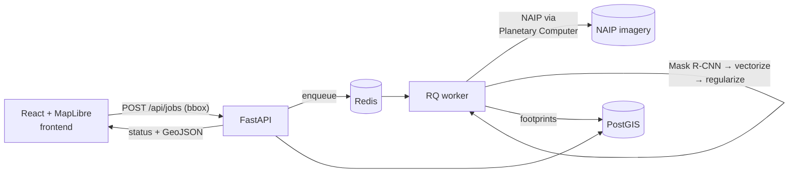

# ParcelVision

Extract building footprints from aerial imagery with computer vision, validate them
against authoritative county parcel data, and export clean vector data in standard
GIS formats.

> **Status: Chapter 1 (MVP) — working end to end.** See [Roadmap](#roadmap).

Draw a bounding box on the map → the backend fetches NAIP imagery, runs a pretrained
segmentation model in an async worker, regularizes the raster masks into clean
orthogonal polygons, stores them in PostGIS, renders them back on the map, and
offers export in four formats.

## What this is (and is not)

Computer vision extracts features that are **visible** in imagery: buildings, roads,
driveways. It **cannot** detect legal parcel boundaries — those are a surveyed
abstraction with no visual signature. ParcelVision therefore:

1. Extracts **building footprints** (and later roads) from NAIP aerial imagery.
2. **Validates** them against authoritative county parcel polygons — buildings per
   parcel, footprints crossing parcel lines, parcels with no detected structure
   (Chapter 3).
3. Exports everything.

The validation loop against real cadastral data is the point; "detecting parcels
from pixels" is not a thing, and this project doesn't pretend otherwise.

## Architecture



Five containers (`docker compose up`): **api** (FastAPI), **worker** (RQ +
geoai/torch), **redis**, **db** (PostGIS 18/3.6), **frontend** (React + MapLibre
behind nginx, which also proxies `/api`).

**Job lifecycle** — the API validates the bbox (area cap via `AOI_BBOX_LIMIT_KM2`),
writes a `jobs` row, and enqueues the job id by dotted path (the API image never
imports the ML stack). The worker walks the row through
`queued → fetching_imagery → running_inference → vectorizing → writing_db →
done | failed`, updating the row at each stage; the frontend polls
`GET /api/jobs/{id}` and renders the same states as a timeline. Inference never
runs in a request handler.

**Pipeline** (worker):

1. `fetch` — `geoai.download_naip` (STAC search + signing against Microsoft
   Planetary Computer), then CRS-aware clip of each quarter-quad to the AOI —
   inference on a full 7000×7000 px tile for a 1 km² request would waste minutes.
2. `segment` — pluggable backend (below) returns raw detections with confidence,
   in the raster's projected CRS.
3. `postprocess` — ML-free: [buildingregulariser] orthogonalizes corners, areas
   are computed in true UTM meters, output is reprojected to EPSG:4326 and
   clipped to the AOI. CRS is asserted at every raster↔vector boundary.
4. `load` — `to_postgis` append into `buildings`, keyed by job id.

**Schema contract** — api and worker are separate images that share tables, not
code: the API owns DDL (`create_all` at startup; alembic is Chapter 2), the worker
writes with plain SQL/`to_postgis` against the same column names. The contract is
documented in `api/app/models.py` and `worker/worker/status.py`.

[buildingregulariser]: https://github.com/DPIRD-DMA/Building-Regulariser

## Quickstart

```sh
cp .env.example .env
docker compose up -d --build     # or: make up
# open http://localhost:3000
```

Draw a box (≤ 1 km²) over a US location, hit **Extract buildings**, watch the
stage timeline, then export. First run downloads the pretrained checkpoint from
Hugging Face into the `model_cache` volume.

No patience for a CPU inference job? Load precomputed results for a St. Louis
County AOI:

```sh
make demo    # boots db/api/frontend, seeds real precomputed footprints
# open http://localhost:3000 → "Load demo AOI"
```

Tests and lint (no local Python needed): `make test`, `make lint`.

## Inference backends

Set `INFERENCE_BACKEND` in `.env`. The tradeoff this table encodes: SAM-family
and Mask R-CNN models are heavy and GPU-hungry, and a cheap app host won't hold
them comfortably — so compute placement is a **config toggle, not a rewrite**.

| Backend     | What it is | When to use |
|-------------|------------|-------------|
| `local_cpu` | Pretrained Mask R-CNN (geoai `building_footprints_usa` checkpoint) on CPU inside the worker container | **Default.** Zero external dependencies, zero per-call cost. A capped (≤ 1 km²) AOI takes minutes; the async worker means slow just means slow, never blocked. |
| `local_gpu` | Same model on CUDA (swap the CPU-wheel line in `worker/Dockerfile`, add nvidia runtime) | Worker host has an NVIDIA GPU. ~10–50× faster; right answer for batch backfills and real usage. |
| `endpoint`  | POST imagery to a hosted GPU endpoint (HF Inference Endpoints, Modal, your own box) | Cheap app tier + rented GPU seconds. Documented stub — `worker/worker/backends/endpoint.py`. |
| `fake`      | Deterministic synthetic rectangles, no ML deps | Tests/CI only (the worker's `slim` image). Never presented as real output. |

A second extraction path — `segment-geospatial` (samgeo) with FastSAM for
zero-shot segmentation — is the documented alternative when there's no
task-specific checkpoint; it's markedly lighter than SAM ViT-H but still
heavier and less building-precise than the fine-tuned Mask R-CNN, so it is not
installed by default.

## API

| Route | Purpose |
|-------|---------|
| `POST /api/jobs` | Submit `{bbox: [minLon, minLat, maxLon, maxLat]}` → `job_id` (413 over area cap) |
| `GET /api/jobs/{id}` | Status polling contract |
| `GET /api/jobs/{id}/buildings` | Results as GeoJSON straight from PostGIS |
| `GET /api/jobs/{id}/export?format=` | `geojson`, `gpkg`, `shp` (zip), `fgdb` (zip, GDAL OpenFileGDB) |
| `GET /api/health` | DB + Redis liveness |

## Versions

Verified against PyPI/npm/Docker Hub on 2026-07-22 and pinned: geoai-py 0.41.2,
segment-geospatial 1.4.1 (not installed by default; see backends), FastAPI
0.139.2, RQ 2.10.0, GeoPandas 1.1.4, buildingregulariser 0.2.5,
`postgis/postgis:18-3.6`, React 19.2, MapLibre GL JS 6.0 (no default export as
of v6 — imports are named), Vite 8.

## Roadmap

- **Ch. 1 — MVP (done):** bbox → NAIP → building segmentation → regularized
  vectors → PostGIS → map → multi-format export; demo seed path; CI.
- **Ch. 2 — Async hardening:** job cancellation, retries/timeouts tuning,
  alembic migrations, compose smoke test in CI.
- **Ch. 3 — Parcel validation:** St. Louis County parcels in PostGIS
  (`data/parcels/`); buildings-per-parcel, footprints crossing parcel lines,
  parcels with no structure — as a panel and an exportable layer.
- **Ch. 4 — Roads:** road extraction as a second feature class.
- **Ch. 5 — Training story:** reproducible fine-tuning notebook (geoai training
  utilities on SpaceNet/Inria or `giswqs/geospatial`), IoU/mAP vs the pretrained
  baseline.

## License

MIT
