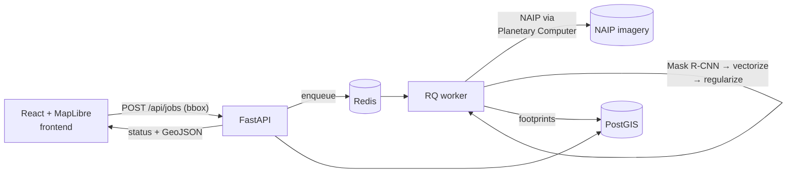

# ParcelVision

Extract building footprints from aerial imagery with computer vision, validate them
against authoritative county parcel data, and export clean vector data in standard
GIS formats.

> **Status: Chapters 1–3, 5, 6 done; RF-DETR + Missouri leaf-off imagery live;
> per-structure roof-condition indicators.** See [Roadmap](#roadmap).

Draw a bounding box on the map → the backend fetches NAIP imagery, runs a pretrained
segmentation model in an async worker, regularizes the raster masks into clean
orthogonal polygons, stores them in PostGIS, renders them back on the map, and
offers export in four formats.

## What this is (and is not)

Computer vision extracts features that are **visible** in imagery: buildings, roads,
driveways. It **cannot** detect legal parcel boundaries — those are a surveyed
abstraction with no visual signature. ParcelVision therefore:

1. Extracts **building footprints** (and later roads) from NAIP aerial imagery.
2. **Validates** them against authoritative county parcel polygons — buildings per
   parcel, footprints crossing parcel lines, parcels with no detected structure
   (Chapter 3).
3. Exports everything.

The validation loop against real cadastral data is the point; "detecting parcels
from pixels" is not a thing, and this project doesn't pretend otherwise.

## Architecture



Five containers (`docker compose up`): **api** (FastAPI), **worker** (RQ +
geoai/torch), **redis**, **db** (PostGIS 18/3.6), **frontend** (React + MapLibre
behind nginx, which also proxies `/api`).

**Job lifecycle** — the API validates the bbox (area cap via `AOI_BBOX_LIMIT_KM2`),
writes a `jobs` row, and enqueues the job id by dotted path (the API image never
imports the ML stack). The worker walks the row through
`queued → fetching_imagery → running_inference → vectorizing → writing_db →
done | failed`, updating the row at each stage; the frontend polls
`GET /api/jobs/{id}` and renders the same states as a timeline. Inference never
runs in a request handler.

**Pipeline** (worker):

1. `fetch` — STAC search against Microsoft Planetary Computer, newest NAIP
   vintage selected from metadata, then **windowed COG reads**: rasterio pulls
   only the AOI's pixels over HTTP range requests (a few MB, ~2 s) instead of
   downloading 480 MB quarter-quads. Retries cover PC's transient 504s.
2. `segment` — pluggable backend (below) returns raw detections with confidence,
   in the raster's projected CRS.
3. `postprocess` — ML-free: [buildingregulariser] orthogonalizes corners, areas
   are computed in true UTM meters, output is reprojected to EPSG:4326 and
   clipped to the AOI. CRS is asserted at every raster↔vector boundary.
4. `load` — `to_postgis` append into `buildings`, keyed by job id.

**Schema contract** — api and worker are separate images that share tables, not
code: the API owns DDL (`create_all` at startup; alembic is Chapter 2), the worker
writes with plain SQL/`to_postgis` against the same column names. The contract is
documented in `api/app/models.py` and `worker/worker/status.py`.

[buildingregulariser]: https://github.com/DPIRD-DMA/Building-Regulariser

## Quickstart

```sh
cp .env.example .env
docker compose up -d --build     # or: make up
# open http://localhost:3000
```

Draw a box (≤ 1 km²) over a US location, hit **Extract buildings**, watch the
stage timeline, then export. First run downloads the pretrained checkpoint from
Hugging Face into the `model_cache` volume.

No patience for a CPU inference job? Load precomputed results for a St. Louis
County AOI:

```sh
make demo    # boots db/api/frontend, seeds real precomputed footprints
# open http://localhost:3000 → "Load demo AOI"
```

Tests and lint (no local Python needed): `make test`, `make lint`.

## Inference backends

Set `INFERENCE_BACKEND` in `.env`. The tradeoff this table encodes: SAM-family
and Mask R-CNN models are heavy and GPU-hungry, and a cheap app host won't hold
them comfortably — so compute placement is a **config toggle, not a rewrite**.

| Backend     | What it is | When to use |
|-------------|------------|-------------|
| `local_cpu` | Pretrained Mask R-CNN (geoai `building_footprints_usa` checkpoint) on CPU inside the worker container | **Default.** Zero external dependencies, zero per-call cost. A capped (≤ 1 km²) AOI takes minutes; the async worker means slow just means slow, never blocked. |
| `local_gpu` | Same model on CUDA (swap the CPU-wheel line in `worker/Dockerfile`, add nvidia runtime) | Worker host has an NVIDIA GPU. ~10–50× faster; right answer for batch backfills and real usage. |
| `endpoint`  | POST imagery to a hosted GPU endpoint (HF Inference Endpoints, Modal, your own box) | Cheap app tier + rented GPU seconds. Documented stub — `worker/worker/backends/endpoint.py`. |
| `fake`      | Deterministic synthetic rectangles, no ML deps | Tests/CI only (the worker's `slim` image). Never presented as real output. |

A second extraction path — `segment-geospatial` (samgeo) with FastSAM for
zero-shot segmentation — is the documented alternative when there's no
task-specific checkpoint; it's markedly lighter than SAM ViT-H but still
heavier and less building-precise than the fine-tuned Mask R-CNN, so it is not
installed by default.

## API

| Route | Purpose |
|-------|---------|
| `POST /api/jobs` | Submit `{bbox: [minLon, minLat, maxLon, maxLat]}` → `job_id` (413 over area cap) |
| `GET /api/jobs/{id}` | Status polling contract |
| `DELETE /api/jobs/{id}` | Cancel: dequeues queued jobs, stops running ones (409 if terminal) |
| `GET /api/jobs/{id}/buildings` | Results as GeoJSON straight from PostGIS |
| `POST /api/jobs/{id}/validate` | Kick off parcel validation (async worker task) |
| `GET /api/jobs/{id}/validation` | Summary + per-parcel GeoJSON (empty / one / multiple / crossing) |
| `GET /api/jobs/{id}/export?format=` | `geojson`, `gpkg`, `shp` (zip), `fgdb` (zip, GDAL OpenFileGDB) |
| `GET /api/health` | DB + Redis liveness |

## Parcel validation (the differentiator)

CV extracts what's *visible*; parcel lines are a surveyed abstraction it can't
see. Chapter 3 closes that gap by validating detected footprints against
**authoritative St. Louis County parcels** (their public ArcGIS REST layer,
owner-neutral fields). After a job finishes, `POST /validate` streams the
parcels covering the AOI into PostGIS and runs spatial joins:

- **buildings per parcel** — interior-point assignment (`ST_PointOnSurface` +
  `ST_Contains`), so one footprint counts for one parcel;
- **footprints crossing a boundary** — `ST_Overlaps` against parcel edges, a
  signal of either a detection error or a genuine lot-line structure;
- **parcels with no detected structure** — the empty-parcel set.

The map shades parcels red (no structure) / amber (multiple) / green (clean 1:1)
with crossing boundaries highlighted, and the panel reports the counts. On the
demo AOI: 44 parcels, 37 with structures, 7 empty, 17 footprints crossing lines
— which also surfaces the model's over-segmentation (avg 3.7 detections/parcel).

## Extraction quality (measured, not vibes)

`worker/scripts/eval_detectors.py` scores each imagery×detector combination
against Overture footprints (IoU ≥ 0.5). Results on the residential demo AOI —
the parcel-level real-estate case that matters:

| imagery | detector | precision | recall | F1 | /parcel |
|---------|----------|----------:|-------:|---:|--------:|
| **leaf-off** | **RF-DETR** (default) | 0.59 | 0.69 | **0.64** | 2.4 |
| NAIP | RF-DETR | 0.52 | 0.44 | 0.48 | 2.2 |
| NAIP | Mask R-CNN | 0.41 | 0.55 | 0.47 | 2.2 |
| leaf-off | Mask R-CNN | 0.18 | 0.38 | 0.25 | 3.7 |
| NAIP | YOLOv8m | 0.67 | 0.11 | 0.19 | 2.0 |

Two findings drove the defaults (RF-DETR + Missouri leaf-off imagery):

- **Leaf-off imagery is worth more than model choice.** RF-DETR's recall jumps
  0.44 → 0.69 once summer canopy stops hiding roofs (see [Imagery](#imagery)).
- **Match the model to the imagery.** Mask R-CNN was trained on leaf-*on* NAIP,
  so it over-detects on leaf-off (precision 0.18); RF-DETR (satellite-trained)
  generalizes and gains. YOLOv8m was eliminated — trained on coarser satellite
  imagery, it misses almost everything at 0.6 m.

Regularization is tuned separately (`buildingregulariser`): leaf-off residential
footprints drop from ~13 to ~6 vertices per polygon with <2% area loss, so
outputs read as clean building outlines rather than stair-stepped masks.
Absolute F1 still undercounts reality (Overture omits garages/sheds our imagery
resolves). The next lever is fine-tuning on leaf-off labels (Chapter 5).

## Versions

Verified against PyPI/npm/Docker Hub on 2026-07-22 and pinned: geoai-py 0.41.2,
segment-geospatial 1.4.1 (not installed by default; see backends), FastAPI
0.139.2, RQ 2.10.0, GeoPandas 1.1.4, buildingregulariser 0.2.5,
`postgis/postgis:18-3.6`, React 19.2, MapLibre GL JS 6.0 (no default export as
of v6 — imports are named), Vite 8.

## Roadmap

- **Ch. 1 — MVP (done):** bbox → NAIP → building segmentation → regularized
  vectors → PostGIS → map → multi-format export; demo seed path; CI.
- **Ch. 2 — Async hardening (done):** job cancellation, history panel,
  streamed COG fetch, alembic migrations, compose smoke test in CI, RQ retries
  with idempotent reruns, restart policies + orphaned-job reconciler.
- **Ch. 3 — Parcel validation (done):** St. Louis County parcels streamed into
  PostGIS per-AOI; buildings-per-parcel, footprints crossing parcel lines,
  parcels with no structure — as a map layer and a summary panel.
- **Ch. 5 — Training story:** reproducible fine-tune of the building detector on
  **leaf-off** imagery — see [Fine-tuning](#fine-tuning-chapter-5).
- **Ch. 6 — Roof condition (done):** per-structure condition indicators — see
  [Roof condition](#roof-condition-chapter-6).
- **Ch. 4 — Roads:** road extraction as a second feature class.

## Fine-tuning (Chapter 5)

The eval showed the pretrained Mask R-CNN, trained on leaf-*on* NAIP, degrades on
our leaf-*off* imagery. `notebooks/train_building_model.ipynb` (and the headless
`worker/scripts/finetune_buildings.py`) close that gap by retraining on the
imagery we actually deploy on:

1. **prepare** — fetch Missouri leaf-off orthoimagery over a training region
   (grid of ArcGIS exports) + Overture footprints as labels, then
   `geoai.export_geotiff_tiles` into aligned image/label tiles.
2. **train** — fine-tune Mask R-CNN from COCO-pretrained weights
   (`geoai.train_MaskRCNN_model`).
3. **evaluate** — score the fine-tuned checkpoint vs the pretrained baseline on a
   held-out leaf-off AOI (per-structure precision/recall/F1).

```sh
# proves the pipeline end to end (few tiles, 2 epochs) — CPU-friendly
docker compose run --rm --no-deps worker python scripts/finetune_buildings.py --smoke
```

Mask R-CNN fine-tuning wants a GPU for a real run (`--epochs 100`); the pipeline
is parameterized so smoke → full is just arguments. Labels are weak (Overture
omits some outbuildings), which caps achievable F1 — a hand-labelled test tile
gives a truer read. The resulting `.pth` drops into the `local_cpu` backend via
`BuildingFootprintExtractor(model_path=...)`.

## Roof condition (Chapter 6)

Parcel-level real-estate intelligence wants a condition signal, not just a
footprint. This one earned a real investigation, because **every off-the-shelf
model failed to transfer to our leaf-off imagery** — validated against a genuine
damaged AOI (2020 Palm St, north St. Louis City) with visual chip inspection:

| Approach | Result |
|----------|--------|
| Colour/brightness heuristic | Too crude — no concept of structural damage |
| moondream (zero-shot VLM) | Broken on CPU (NaN in generation) |
| CLIP (zero-shot) | Not grounded — scored a **swimming pool 0.95 "damaged"**; ranking flipped on prompt wording |
| SegFormer xView2 (supervised, satellite) | Predicted **zero** damage anywhere, even collapsed roofs |
| RescueNet YOLO (supervised, aerial) | Called **intact campus buildings "damaged,"** missed ~90% of buildings |

The two supervised models failed in *opposite* directions — the signature of a
domain gap (post-disaster satellite/UAV → Missouri leaf-off dereliction), not a
tuning problem. Same discipline as "don't detect parcels from pixels": none were
shipped.

**What works is training on our own imagery.** A ResNet18 on leaf-off roof
chips. v3 used **weak geographic labels** (derelict areas = damaged, suburbs =
intact) and under-called obvious damage; **v4** uses ~120 **hand-labelled** 0.15 m
chips + augmentation (`worker/scripts/make_label_pool.py` builds the montages,
`train_condition_v4.py` trains) and is markedly crisper. Held-out per-building
validation on Palm St vs the demo:

| P(damaged) median | v3 | **v4** |
|---|---|---|
| Palm St (damaged) | 0.97 | **1.00** |
| demo residential (intact) | 0.18 | **0.02** |

v4 correctly leaves the *intact* buildings within the Palm St block at `0.00`
(real within-area discrimination) and, unlike CLIP, scores a **swimming pool
0.00**.

Each footprint gets `roof_damage_score` (classifier P(damaged)) + `tarp_fraction`
(a complementary colour signal), and a `condition` flag: `tarp` > `damaged` >
`review` > `ok`. Footprints are shaded by condition on the map, shown in the
click popup, and rolled up in the results/report panels.

**Honest limitations:** it's strong on *residential* roofs (the business target)
but still **over-flags large flat/institutional roofs** (the demo AOI straddles
the WashU campus, so its "damaged" count is mostly campus buildings, not homes).
The eval harness
(`worker/scripts/validate_damage_clip.py`) scores any approach against Palm St vs
a normal AOI with visual output. The real accuracy ceiling is clean per-building
labels (city vacancy/condemned data) + a GPU — the pipeline is ready for them.

## License

MIT
