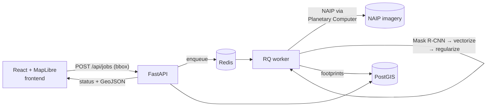

# ParcelVision

Extract building footprints from aerial imagery with computer vision, validate them
against authoritative county parcel data, and export clean vector data in standard
GIS formats.

> **Status: Chapter 1 (MVP) — in progress.** See [Roadmap](#roadmap).

Draw a bounding box on the map → the backend fetches NAIP imagery, runs a pretrained
segmentation model in an async worker, regularizes the raster masks into clean
orthogonal polygons, stores them in PostGIS, renders them back on the map, and
offers export.

## What this is (and is not)

Computer vision extracts features that are **visible** in imagery: buildings, roads,
driveways. It **cannot** detect legal parcel boundaries — those are a surveyed
abstraction with no visual signature. ParcelVision therefore:

1. Extracts **building footprints** (and later roads) from NAIP aerial imagery.
2. **Validates** them against authoritative county parcel polygons — buildings per
   parcel, footprints crossing parcel lines, parcels with no detected structure.
3. Exports everything.

The validation loop against real cadastral data is the point; "detecting parcels
from pixels" is not a thing, and this project doesn't pretend otherwise.

## Architecture



Services (docker-compose): `api` (FastAPI), `worker` (RQ + geoai/torch), `redis`,
`db` (PostGIS), `frontend` (React + MapLibre behind nginx).

Job lifecycle: `queued → fetching_imagery → running_inference → vectorizing →
writing_db → done | failed`. Inference never runs in a request handler.

## Quickstart

```sh
cp .env.example .env
docker compose up -d --build     # or: make up
# open http://localhost:3000
```

No GPU? No patience for a CPU inference job? Run the demo path, which loads
precomputed results for a St. Louis AOI:

```sh
make demo
```

## Inference backends

Set `INFERENCE_BACKEND` in `.env`:

| Backend     | What it is | When to use |
|-------------|------------|-------------|
| `local_cpu` | Pretrained Mask R-CNN ([geoai](https://github.com/opengeos/geoai)) on CPU in the worker container | Default. Zero external deps; slow (minutes per small AOI). The bbox size cap (`AOI_BBOX_LIMIT_KM2`) keeps this tolerable. |
| `local_gpu` | Same model on CUDA | Worker host has an NVIDIA GPU + container toolkit. ~10–50× faster. |
| `endpoint`  | Hosted inference endpoint | Cheap app host, rented GPU. Stub — see `worker/worker/backends/endpoint.py`. |
| `fake`      | Deterministic synthetic rectangles, no ML deps | Tests/CI only. Never presented as real output. |

The async worker design means a slow backend just takes longer — it never blocks
the API. That constraint (heavy models, cheap hardware) is designed around, not
hidden. <!-- TODO(ch1): expand tradeoff analysis -->

## Versions

Verified against PyPI/npm on 2026-07-22: geoai-py 0.41.2, segment-geospatial 1.4.1
(secondary zero-shot path, documented but not installed by default), FastAPI
0.139.2, RQ 2.10.0, GeoPandas 1.1.4, `postgis/postgis:17-3.6`, React 19.2,
MapLibre GL JS 6.0, Vite 8.

## Roadmap

- **Ch. 1 — MVP (current):** bbox → NAIP → building segmentation → regularized
  vectors → PostGIS → map → GeoJSON export.
- **Ch. 2 — Async hardening:** cancellation, bbox guard rails, CI green, alembic
  migrations.
- **Ch. 3 — Parcel validation:** St. Louis County parcels in PostGIS; spatial-join
  validation layers.
- **Ch. 4 — Roads + exports:** road extraction; GeoPackage / Shapefile / File
  Geodatabase (GDAL OpenFileGDB).
- **Ch. 5 — Training story:** reproducible fine-tuning notebook with IoU/mAP vs
  the pretrained baseline.

## License

MIT
